# Thursday

A personal agent harness for your own PC: a fast voice agent takes your short instructions and hands them to a main agent that carries them out with tools, with a dashboard and an Android app to watch and control it.

> Status: working end to end on Windows with LM Studio. Built: the gateway, voice agent, main agent, built-in tool server, speech service, metrics collector, launcher, the web dashboard, and the Android app. You can type or talk (push-to-talk), have replies read aloud, approve risky steps, pause and stop tasks, and follow everything live from the PC or the phone. Not built: continuous listening.

## What problem it solves

Running a capable local agent on your own machine usually means one chat box and a long wait. Thursday splits the work: a small, quick voice agent keeps the conversation going while a larger main agent works through your instructions step by step, asks before doing anything risky, and tells you what happened, from the PC or from your phone.

## What it does

- Chat or talk with a voice agent that delegates tasks to a main agent over the A2A protocol.
- The main agent runs tools on your PC through MCP tool servers, including a built-in one for files and shell.
- Each task shows as a card that opens into its steps: every delegation, LLM call, tool call, approval, and result. A Trace screen keeps the full detail.
- Risky actions ask you first: allow once, allow always for that chat, or deny.
- Pause, resume, and stop a running task from the UI or by asking the voice agent.
- Projects with their own folders, each holding many chats, with search and history. Deleting a chat or project removes every record of it.
- A web dashboard on the PC and a native Android app reached over Tailscale, with notifications when the phone is locked.
- Talk instead of typing: push-to-talk (speech to text with Whisper) and replies read aloud (Kokoro), both running locally on the CPU.
- A voice field behind the chat: a line of particles that drifts like a breeze and pulses with sound, and a face made of particles that gathers while Thursday listens, thinks, and speaks (it can be switched off).
- Monitoring: tokens per second, context use, latency, VRAM, RAM, CPU, network, queues.
- Works with LM Studio (with model load parameters) or any OpenAI-compatible endpoint.

## How it works

You talk to the voice agent through the gateway. It turns your instruction into an A2A task for the main agent, which plans and calls tools through MCP. Progress and approval requests flow back as events to the gateway, which feeds the dashboard and the phone. Each service owns its own data; the gateway keeps a read model of events for the screens. Speech is a separate local service: the gateway has your recording transcribed and the text is sent as a normal message.



Detailed design: [architecture](docs/ARCHITECTURE.md), [flows](docs/FLOWS.md), [contracts](docs/CONTRACTS.md), [security](docs/SECURITY.md).

## How it integrates

- An LLM endpoint: LM Studio locally, or any OpenAI-compatible service. You provide the endpoint and any API key.
- MCP tool servers started as local stdio processes.
- Tailscale for the phone connection, with HTTPS certificates enabled on your tailnet.
- Local speech models (Whisper and Kokoro), downloaded once on first use.

Contracts and verified integration notes are in [docs/CONTRACTS.md](docs/CONTRACTS.md).

## Requirements

- A Windows PC with a GPU suitable for the models you choose
- LM Studio (or another OpenAI-compatible endpoint)
- Python with `uv`
- Node.js 20 or newer to build the dashboard (verified with Node 24)
- For the phone: Tailscale on the PC and the phone, and an Android phone (Android 11 or newer)
- To build the Android app yourself: a JDK 21 and the Android SDK

## Installation

### Windows 11 (verified)

Requires [uv](https://docs.astral.sh/uv/). uv installs Python 3.12 if needed.

```bash
uv sync
```

Create `.env` and the service token (this copies `.env.example` if `.env` does not exist and only fills in `THURSDAY_SERVICE_TOKEN`):

```bash
uv run thursday setup
```

Fill in the LLM settings in `.env` (see API keys below). Build the dashboard once (and again after updating Thursday):

```bash
npm ci --prefix apps/dashboard
```

```bash
npm run build --prefix apps/dashboard
```

Then start everything:

```bash
uv run thursday up
```

This starts the gateway, voice agent, main agent, metrics collector, and speech service as native processes on localhost, checks their health, and restarts any that crash. The main agent starts the built-in tool server for each project on demand. Open the dashboard at http://127.0.0.1:8700 (the gateway's localhost port) and add a project folder. To stop everything, press Ctrl+C in that terminal, or run this from any terminal:

```bash
uv run thursday down
```

It asks the running supervisor to shut the services down cleanly, and force-stops any service left behind. To check them once from another terminal:

```bash
uv run thursday status
```

Data and logs go to `%LOCALAPPDATA%\Thursday` unless `THURSDAY_DATA_DIR` is set.

macOS and Linux are not supported targets for version 1.

### Reaching Thursday from your phone

The phone connects over Tailscale to the gateway's proxy port, which always requires a paired device token. With HTTPS certificates enabled on your tailnet, publish the proxy port inside your tailnet (not to the internet):

```bash
tailscale serve --bg http://127.0.0.1:8701
```

Then open Settings, Devices in the dashboard and make a pairing code. The code is made only on the PC, works once, and expires after five minutes; the dashboard shows it as text and as a QR code. The dashboard shows this PC's tailnet address, found with `tailscale status`; set `GATEWAY_PUBLIC_URL` in `.env` to override it.

### Android app

The signed APK of the current version is in this repository: [apps/android/release/Thursday-1.0.0.apk](apps/android/release/Thursday-1.0.0.apk). Copy it to a phone that is on your tailnet and install it (Android asks you to allow installing from this source the first time), open Thursday, and scan the pairing code from the dashboard. Each phone pairs separately and can be revoked in Settings, Devices.

To build the APK yourself, from `apps/android` with a JDK 21 in `JAVA_HOME`:

```bash
./gradlew :app:assembleRelease
```

The signed APK is written to `app/build/outputs/apk/release/app-release.apk`. Signing reads `apps/android/keystore.properties` (`storeFile`, `storePassword`, `keyAlias`, `keyPassword`), which is ignored by git along with the key file; without it the release build is left unsigned. Keep the key and its password backed up somewhere safe: a phone only accepts an update signed with the same key. A debug build (`./gradlew :app:assembleDebug`) needs no key but cannot replace a release build on a phone without uninstalling it first.

## API keys

API keys and tokens are read from a `.env` file, which is ignored by git. The tracked [`.env.example`](.env.example) lists every setting with placeholder or example values.

1. Copy `.env.example` to `.env`.
2. For LM Studio, set `LMSTUDIO_API_TOKEN` to your LM Studio API token; both agents use it unless you set their own `VOICE_LLM_API_KEY` or `MAIN_LLM_API_KEY`. Cloud providers need those per-agent keys. Leave a key empty only if the endpoint accepts requests without one.
3. Set the provider, base URL, and model for each agent (`VOICE_LLM_*` and `MAIN_LLM_*`).
4. `THURSDAY_SERVICE_TOKEN` is generated by `uv run thursday setup`; do not share it.

The app never writes keys, and Settings only shows whether each key is set. After editing `.env`, use the reload button in Settings (or restart the service). A cloud provider sends everything in the model context off your PC.

## Status and limitations

- The services, the dashboard, and the Android app work end to end on Windows 11 and Android 15.
- Voice is push-to-talk with replies read aloud, on the dashboard and the phone; the first use downloads the speech models (about 0.5 GB for Whisper `small` and 0.35 GB for Kokoro). Continuous listening is not built.
- On the phone the speaking face moves to a speech-like pattern, not the actual audio; on the dashboard it follows the audio.
- The voice field's face was derived from a stock picture. Check that picture's licence before publishing this repository, or replace `face-cloud.bin`.
- Windows and Android are the supported targets for version 1; macOS and Linux may come later.

## Project structure

Thursday is one repository with a folder for each part. The Python parts form a single [uv workspace](https://docs.astral.sh/uv/concepts/projects/workspaces/) that shares one `uv.lock`; each is its own package with one job and a short list of things it may depend on. Services never import each other: they talk over HTTP, A2A, and MCP, and share only the small packages marked below.

```text
thursday/
├── README.md                    this page
├── pyproject.toml               the uv workspace: lists every Python package below
├── uv.lock                      pinned versions of all Python dependencies
├── .python-version              Python 3.12
├── .env.example                 every setting with example values; copy to .env (never committed)
├── .gitignore  .gitattributes   what git leaves out; line endings and binary files
├── thursday_logo.png            the logo (the apps carry resized copies)
│
├── contracts/                   the messages services send each other (shared)
│   ├── src/thursday_contracts/      event envelope, approvals, health, metrics, problems, task control
│   ├── schemas/                     committed JSON Schema of each message (guards against accidents)
│   └── tests/
│
├── packages/                    shared plumbing, used by the services
│   ├── runtime/                     settings from .env, data and log folders, JSON logging, health routes,
│   │                                service-token auth, the event outbox, backups
│   └── llm/                         talking to a model: LM Studio and OpenAI-compatible providers,
│                                    model loading, request capture, stream timing
│
├── services/                    the programs that run (each: src/<name>/ with the layers it needs out of
│   │                            transport, application, domain, infrastructure, bootstrap; plus tests/)
│   ├── gateway/                     the one door for clients: projects, chats, pairing, task control,
│   │                                read model, live stream, file views; serves the dashboard
│   ├── voice_agent/                 the conversation: answers quickly and delegates tasks
│   ├── main_agent/                  does the work: agent loop, approvals, context, MCP client
│   ├── tool_server/                 the built-in tools (files, shell) with sandbox and permission policy;
│   │                                started by the main agent, one per project
│   ├── speech/                      speech to text (Whisper) and text to speech (Kokoro), on the CPU
│   └── metrics_collector/           reads CPU, RAM, GPU, and network and pushes them to the gateway
│
├── launcher/                    `uv run thursday up | down | status | setup`: starts the services,
│                                restarts a crashed one, and prints the report you see in the terminal
│
├── apps/
│   ├── dashboard/               the PC web app (Svelte 5, Vite, TypeScript)
│   │   ├── src/lib/                 api (gateway calls), live (stream and polling), state, ui (shared
│   │   │                            components, markdown, the voice field), styles
│   │   ├── src/features/            one folder per screen: shell, chat, projects, trace, tools, monitor, settings
│   │   ├── public/                  logo and icons
│   │   ├── e2e/                     browser tests against a fake gateway
│   │   └── dev/voicefield.html      try the voice field's states without a chat (dev server only)
│   └── android/                 the phone app (Kotlin, Jetpack Compose)
│       ├── app/src/main/java/app/thursday/
│       │   ├── ui/                  screens: pair, chats, chat, projects, trace, tools, monitor, settings
│       │   ├── live/                the live connection, app state, background service, notifications
│       │   ├── domain/              pure logic with unit tests: timeline, grouping, charts, markdown, voice field
│       │   ├── data/                gateway client, pairing link, secure token storage
│       │   ├── security/            fingerprint or PIN checks
│       │   └── voice/               push-to-talk recording and spoken replies
│       ├── app/src/main/assets/     the voice field's face data
│       ├── app/src/test/            unit tests
│       └── release/                 the signed APK, ready to install
│
└── docs/                        the design, in pages
    ├── README.md                    index of the pages and how diagrams are made
    ├── PROJECT.md  ARCHITECTURE.md  FLOWS.md  CONTRACTS.md  SECURITY.md
    └── diagrams/                    the pictures (generated from the Mermaid in the pages by render.mjs)
```

### What `contracts/` is for

Services must not import each other's code, yet they have to agree exactly on the shape of what they send: an event, an approval request and its answer, a health report, a metrics sample, an error. `contracts/` is the one small package that holds those shapes and nothing else: no business rules and no service internals. Every service imports it, so they all speak the same language.

- It defines the event envelope (what the agents send the gateway, with its ID and per-source order), the approval request and answer, health and readiness reports, the metrics sample, the problem format for errors, and the constants of the pause and resume extension.
- `contracts/schemas/` holds a JSON Schema of every message. A test compares each message with its committed schema, so a message cannot change by accident. After an intended, versioned change, regenerate them with `THURSDAY_UPDATE_SCHEMAS=1 uv run pytest contracts` and commit the result.
- Breaking changes need a new `schema_version` (events), a new extension URI, or a new REST prefix, as set out in [docs/CONTRACTS.md](docs/CONTRACTS.md), which also describes how the services use these messages.

### Created on your machine, not in the repository

| Path | What it is |
|---|---|
| `.env` | Your settings and keys (from `.env.example`) |
| `.venv/` | Python environment made by `uv sync` |
| `apps/dashboard/node_modules/`, `apps/dashboard/dist/` | Dashboard dependencies and the built dashboard the gateway serves |
| `apps/android/app/build/`, `apps/android/.gradle/` | Android build output |
| `apps/android/keystore.properties`, `apps/android/*.jks` | The key that signs the Android app: keep it safe and backed up |
| `%LOCALAPPDATA%\Thursday\` | Databases, logs, backups, and downloaded speech models (or `THURSDAY_DATA_DIR`) |

## Documentation

- [Design documents](docs/README.md)
