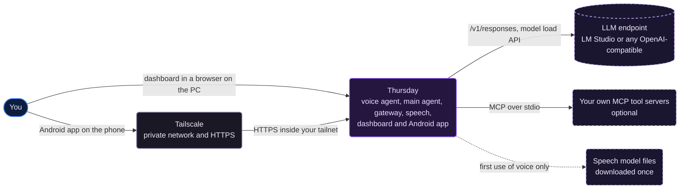
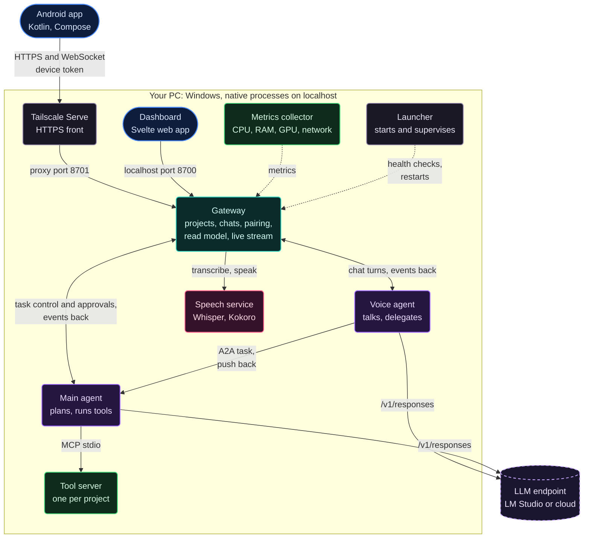
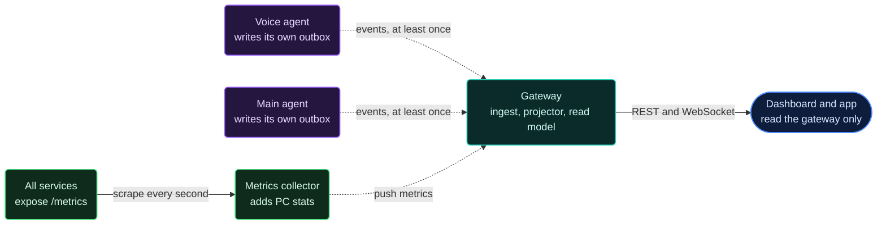
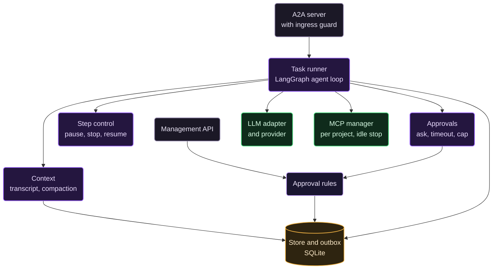
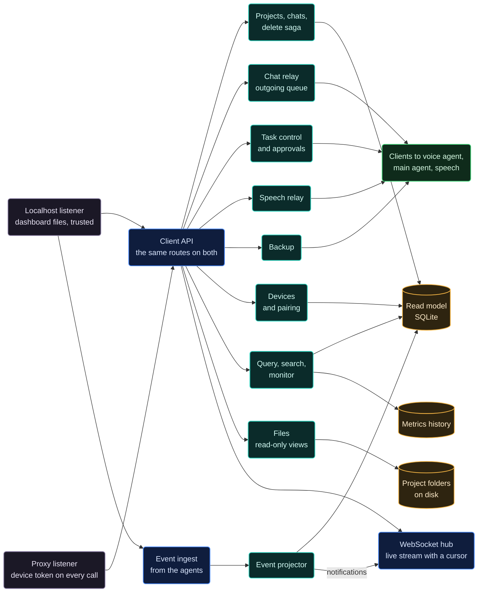

# System Architecture

Status: Accepted design (2026-09-30), updated to the system as built (2026-10-01). Each picture is rendered from the Mermaid text folded under it, which is the editable source (see [README](README.md#diagrams)).

## System context (C4 level 1)

Mermaid source

Everything Thursday needs at run time is on your PC. The phone reaches it only through your own Tailscale network, the Android app keeps its own connection to the gateway, and no cloud push service is involved. The speech models (Whisper and Kokoro) are downloaded the first time voice is used and run locally after that.

## Containers (C4 level 2)

This is the picture the root README shows.

Mermaid source

| Container | Responsibility | Owns |
|---|---|---|
| Dashboard | Presentation on the PC: chat with the voice field, trace, tools, monitor, settings | Nothing on the PC; per-browser preferences (theme, panel width, face animation, drafts) |
| Android app | Presentation on the phone, notifications with the phone locked, push-to-talk, optional app lock | Device token in the Android Keystore; per-phone preferences |
| Gateway | The single client-facing door: projects, chats, settings, pairing and devices, task control, event ingest, read model, notifications, read-only file views, speech relay, retention, backup orchestration. Serves the dashboard's files | Projects, chat list, devices (token hashes), non-secret settings, the read model (timeline, traces 30 days, notifications, metrics history) |
| Voice agent | Conversation, delegation, task-update relay, spoken approvals recognised in code | Voice transcripts per chat, its system prompt and versions, its LLM configuration, its outbox |
| Main agent | Task execution: agent loop, step control, approvals, context, MCP client | Main transcripts and LangGraph checkpoints per chat, allow-always rules, task records and call-started marks, its system prompt and versions, its LLM configuration, its outbox |
| Tool server | Runs tools, enforces workspace sandbox and permission policy | Its own SQLite call and audit log, one file per project |
| Speech service | Speech to text (faster-whisper) and text to speech (Kokoro), on the CPU | The downloaded model files. No audio is stored |
| Metrics collector | Reads PC CPU, RAM, VRAM (per GPU), network; scrapes service `/metrics`; pushes to the gateway | In-memory samples only |
| Launcher | Starts the services, checks their health, restarts a crashed one, stops them (`thursday up`, `down`, `status`, `setup`) | A pid file and a stop file while running |
| Tailscale Serve | Terminates HTTPS for tailnet traffic and forwards to the gateway proxy port | Certificates (managed by Tailscale) |

The gateway talks to the speech service, not the voice agent: a client records audio, the gateway has it transcribed, and the text is then sent as an ordinary chat message (see [FLOWS.md](FLOWS.md#voice-push-to-talk-and-read-aloud)).

### Events, logs, and metrics flow

Mermaid source

### Data rules

- Each service owns its data. No service reads another's tables. Clients read only the gateway.
- Agents write events to a local **outbox** and a background sender delivers them to the gateway at least once. The gateway deduplicates by `event_id` and keeps per-source ordering by `seq`. A service never waits on the gateway.
- The read model is a projection and can be rebuilt: each agent exposes a replay endpoint ("my events since N").
- Deleting a chat or project is an idempotent saga: the gateway stops the chat's running tasks, marks it deleting, asks each owning service to delete (repeatable), retries until all confirm, then removes its own records. Nothing about the chat is left in any database; only the folder on disk is left alone.
- Every service keeps versioned forward-only migrations and takes a backup before migrating.

## Components (C4 level 3)

Each service uses the layers transport, application, domain, infrastructure. Dependencies point toward the domain; infrastructure implements interfaces defined by the application layer.

### Main agent

Mermaid source

Domain objects: task state machine, approval rule (scoped to a chat), chat context. The LLM adapter sits behind a **provider interface** with two providers: LM Studio (chat plus model lifecycle: list, load, unload, loaded context length, speed stats) and generic OpenAI-compatible (chat only). A **model manager** in the adapter adopts an already-loaded model or loads it with the configured parameters before the first request.

### Voice agent

| Layer | Components |
|---|---|
| Transport | Chat API (from gateway), A2A client with push-webhook receiver |
| Application | Conversation (LLM turns), Delegation (tasks, pause, stop, resume), Notifier (relays task updates into the chat), spoken-approval recognition in code |
| Domain | Chat context, delegated-task record |
| Infrastructure | LLM adapter with the same provider interface and model manager, store and outbox (SQLite), metrics |

### Gateway

Mermaid source

The gateway has **two listeners**: a localhost-only one for the dashboard on the PC (trusted, no pairing; it also serves the dashboard's files and accepts events from the agents) and one for Tailscale Serve that requires a device token on every call except claiming a pairing code. Pairing codes can only be made on the localhost listener. The projector raises the immediate plain approval notification from the event stream, independent of the voice agent.

### Tool server (built-in)

| Layer | Components |
|---|---|
| Transport | MCP stdio server |
| Application | Tool router, permission gate (asks through the MCP input-required result), session manager (shell session handles) |
| Domain | Policy (ask, allow, deny), workspace root and path rules |
| Infrastructure | File tools (read, write, edit, patch, delete), shell runner, SQLite audit and call log |

Tools in the first version: shell, shell session, `fs.read`, `fs.write`, `fs.edit`, `fs.patch`, `fs.delete`. The owner's own MCP server can replace or join it behind the same MCP contract.

### Speech service

| Layer | Components |
|---|---|
| Transport | HTTP: `/v1/transcribe`, `/v1/speak`, `/v1/voices` (service token) |
| Application | Speech service: one request at a time per engine; text is cleaned of markdown and cut at a sentence before it is spoken |
| Infrastructure | Whisper transcriber (faster-whisper, `small` by default, int8 on the CPU), Kokoro speaker (ONNX on the CPU, 54 voices); both load on first use; Kokoro's files download once into the service's data folder |

### Android app

| Layer | Packages |
|---|---|
| Presentation | `ui/*` (Compose): pair, chats, chat, projects and files, trace, tools, monitor, settings; `ui/chat/VoiceField` draws the voice field |
| Live | `live/`: one WebSocket with a cursor and backoff, the app's live state, a foreground service (type `remoteMessaging`) that keeps the connection so approvals notify with the phone locked, notifications |
| Domain | `domain/`: pure Kotlin with unit tests: timeline from events, grouping, chart series, markdown, the face cloud and the voice field's motion |
| Data | `data/`: gateway REST client (OkHttp, calls off the main thread), models, pairing link, token store (Android Keystore) |
| Security and voice | `security/Guard`: phone credential or fingerprint before risky approvals and settings; `voice/VoiceIO`: push-to-talk recording and playback of spoken replies |

### The voice field (dashboard and app)

The voice agent's presence in a chat is a field of particles behind the messages.

- **The line** along the bottom is always there: a ribbon of particles that a mild breeze carries across the screen. With sound it pulses, low tones on the left and high tones on the right, taller when louder.
- **The face** gathers while the agent listens, thinks, or speaks, and is blown away on the breeze when it goes idle. It can be turned off (Settings, Appearance on the dashboard; Settings, Phone in the app); the line stays.
- The face is a cloud of about 20,000 particles in one binary file, `face-cloud.bin`, shipped with both clients (format in `apps/dashboard/src/lib/ui/facecloud.ts`). Each particle has a position in 3D, a brightness, how loose it is, and how much it moves with the jaw and lips, so the head can turn a little and the mouth can follow speech. The phone uses about half of the particles.
- The dashboard draws it with WebGL in one call (all movement is computed in the shader from a handful of numbers per frame); the app computes the same sums in Kotlin and draws batched points. The rules live in `fieldmotion.ts` and `FieldMotion.kt` and are unit tested.
- Sound comes from the microphone while listening and from the spoken reply while speaking (the dashboard analyses the real audio; the app uses the microphone's loudness and a speech-like pattern for replies).

## Technology choices

| Area | Choice | Reason |
|---|---|---|
| Services | Python 3.12, FastAPI, Pydantic, `uv` workspace, SQLite per service | Project defaults; local single-node workload |
| Main agent runtime | LangChain `ChatOpenAI` plus LangGraph (checkpoints, `interrupt`) | Owner's choice; verified by spike S3 |
| Voice agent | Plain loop with the same LLM adapter | Low latency, no checkpoints needed |
| Agent protocol | A2A 1.0 via the `a2a-sdk` Python package | Verified by spike S1 |
| Tools | MCP via the `mcp` Python SDK, stdio | Verified by spike S2 |
| Speech | faster-whisper `small` and Kokoro (ONNX), both on the CPU | Spike S5: the LLM endpoint does not take audio; these run well on the CPU and leave the GPU to the models |
| Dashboard | Svelte 5, Vite, TypeScript; built to static files served by the gateway; WebGL for the voice field | Small bundle, no server of its own |
| Android | Kotlin, Jetpack Compose, OkHttp, CameraX and ML Kit for the pairing QR code | Owner's choice of a native app |
| Phone connection | Tailscale Serve in front of the gateway's proxy port | HTTPS inside the tailnet only; nothing is exposed to the internet |

## Source layout and boundary map

One uv workspace with a single lockfile. Each folder is its own package with one responsibility. Services never import another service's package.

| Package | Folder | Owns | May depend on |
|---|---|---|---|
| `thursday-contracts` | `contracts/` | Published schemas only: event envelope, health reports, approval request and answer, task-control extension constants, problem details. JSON Schema snapshots in `contracts/schemas/` guard against accidental changes | pydantic |
| `thursday-runtime` | `packages/runtime/` | Shared technical plumbing: settings from `.env`, per-user data and log folders, JSON-lines logging with rotation, health and readiness routes, service-token auth, localhost serving, and the event outbox (own SQLite file per service, publisher, sender with backoff, replay) | contracts, FastAPI, uvicorn, pydantic-settings, httpx |
| `thursday-llm` | `packages/llm/` | Shared LLM provider layer: provider interface, LM Studio lifecycle (adopt a loaded model, else load with parameters; unload; reload), OpenAI-compatible provider, chat model factory (Responses API), raw body capture (bodies only), stream timing | langchain-openai, httpx |
| `thursday-gateway` | `services/gateway/` | Projects, chats, outgoing message queue, read model (events, tasks, approvals, notifications, messages), relay to the voice agent, task control and approvals to the main agent, devices and pairing, read-only file views, speech relay, delete saga, dependency banners, WebSocket hub, metrics history; two listeners | contracts, runtime, a2a-sdk (types only), httpx |
| `thursday-voice-agent` | `services/voice_agent/` | Per-chat transcripts, delegated tasks and their push tokens, turn idempotency, prompt versions; conversation loop with task tools; spoken-approval recognition in code; push webhook | contracts, runtime, llm |
| `thursday-main-agent` | `services/main_agent/` | Tasks, approvals, allow-always rules, call marks, chat transcripts, prompt versions; LangGraph runner (one thread per task); A2A server with ingress guard; MCP manager; management API | contracts, runtime, llm, a2a-sdk, langgraph, mcp |
| `thursday-tool-server` | `services/tool_server/` | Workspace sandbox, permission policy, file tools, shell and shell sessions with process-tree kill, audit log (one SQLite file per project); MCP stdio server started by the main agent | runtime, mcp |
| `thursday-speech` | `services/speech/` | Local speech on the CPU: speech to text with faster-whisper (`small` by default) and text to speech with Kokoro (ONNX, 54 voices). Engines load on first use behind small interfaces; one request at a time per engine; no audio is stored. Kokoro's model files download once into the service's data folder | contracts, runtime, faster-whisper, kokoro-onnx, httpx |
| `thursday-metrics-collector` | `services/metrics_collector/` | Samples CPU, RAM, network (psutil) and per-GPU VRAM (NVML) every second, scrapes each service's `GET /metrics` (latency and queue loads), pushes to the gateway; memory only | contracts, runtime, psutil, nvidia-ml-py, httpx |
| `thursday-launcher` | `launcher/` | Starts the HTTP services as native processes, polls `/health`, restarts a crashed service after a capped exponential delay (1 s doubling to 30 s, reset after 60 s of stable running), adopts a service already running on its port, and stops services gracefully (CTRL_BREAK on Windows, then a forced kill); `down` stops a running supervisor from any terminal; `setup` generates the service token | contracts, runtime, httpx, psutil |
| Dashboard (npm, not a uv package) | `apps/dashboard/` | The PC web UI: Svelte 5, Vite, TypeScript, built to static files the gateway serves on its localhost listener. `src/lib/api` (typed gateway calls, no state), `src/lib/live` (the one event-stream socket with cursor replay and backoff; visibility-aware polling), `src/lib/state` (app-wide state, one chat session, pure event-to-view functions, hash routes, per-browser preferences, voice input and output), `src/lib/ui` (shared components, the markdown renderer, and the voice field), `src/features/*` (one folder per screen: shell, chat, projects, trace, tools, monitor, settings) | gateway REST and WebSocket only |
| Android app (Gradle, not a uv package) | `apps/android/` | The phone UI: Kotlin and Compose, packages `ui`, `live`, `domain`, `data`, `security`, `voice` as in the table above. Release builds are signed with a key kept outside the repository | gateway REST and WebSocket only |

Inside a service, dependencies point inward: `transport` and `infrastructure` depend on `application`, which depends on `domain`; only `bootstrap` wires concrete adapters.

Also as built: the metrics collector samples every second (`METRICS_SAMPLE_INTERVAL_SECONDS`); the gateway streams every sample on `/v1/metrics/stream` only while a Monitor screen holds it open, and stores history at most every 5 seconds for 24 hours and one sample per minute for the retention period. Backups: the gateway asks each service to copy its own SQLite files (SQLite online backup) into one timestamped folder with a manifest, keeps the newest N copies, and never includes `.env`. Keep-awake: the main agent holds a Windows power request while a task runs or waits for approval, and for a limited time while paused. Compaction: at the threshold (90 percent by default) the main agent summarises older turns with the same model; the model then sees the summary, the current instruction word for word, and the recent steps, while the full transcript is kept.

Dashboard, as built: the gateway's localhost listener serves `apps/dashboard/dist` and guards browser traffic (Host must be the listener's own address; any Origin must be its own; writes need the `X-Thursday-Client` header; a CSP on pages), which blocks cross-site requests and DNS rebinding. The dashboard opens one event-stream socket, joins it at `stream_pos` from `/v1/status`, and merges stored and live data by event position. Chat state (messages, task cards, approvals, streamed replies) lives in one chat session at a time; other screens poll only while visible, and Monitor holds the metrics socket only while it is on screen. Pairing: the gateway makes one-time codes on the localhost listener only, stores device tokens hashed, rate limits claims, and closes a revoked device's sockets at once.

Main agent execution, as built: each task runs on its own LangGraph thread seeded from the chat transcript; finished tasks are appended to the transcript. The A2A executor returns on an approval (`INPUT_REQUIRED`) or a pause (`WORKING`, paused); the next message resumes from the checkpoint. Approval timeouts, resume after pause, and restart recovery re-enter through the SDK with an in-process message that remote callers cannot send.

## Runtime and delivery

- **Native processes** on a Windows PC, started by the **launcher** (`uv run thursday up`), which checks health and restarts crashed services with a delay; `uv run thursday down` stops them. No Docker for the harness because the tool server and metrics need the host filesystem, shell, and GPU. LM Studio and Tailscale run beside it as separate applications.
- Ports, all on localhost: gateway 8700 (dashboard and trusted API) and 8701 (proxy listener for Tailscale Serve), voice agent 8710, main agent 8711, metrics collector 8720, speech 8730.
- Every service has its own health and readiness checks and keeps running when another is down. The gateway shows banners for down dependencies; Monitor shows service state and restart counts.
- Structured logs per service outside the repository, with rotation, carrying chat, task, and event IDs.
- The PC is kept awake while a task is running or waiting for approval (a paused task holds it for up to 30 minutes by default); this cannot stop a manual sleep or lid close.
- The repository is a monorepo: a folder per service, the dashboard, the Android app, and a small contracts package that contains only stable schemas.
- Releases: the dashboard is built to static files; the Android app is a signed APK built locally (`./gradlew :app:assembleRelease`) that can be copied to any phone on the tailnet. The signing key and its password stay outside the repository.

## Reliability and freshness requirements

- Live timeline and notifications reach clients within a few seconds under normal load; clients reconnect with a cursor and replay missed events.
- Visible screens refresh; hidden screens do not poll. Monitor data is pushed to a client only while Monitor is visible.
- Services time out and bounded-retry every cross-service call; each important interaction defines idempotency (see [CONTRACTS.md](CONTRACTS.md)).
