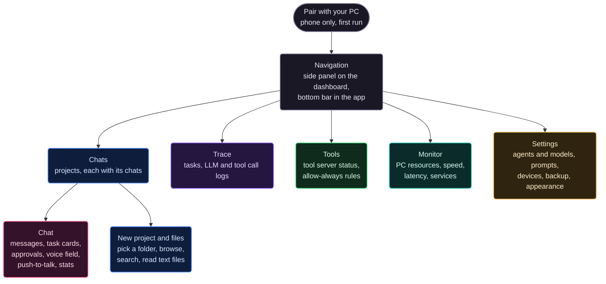
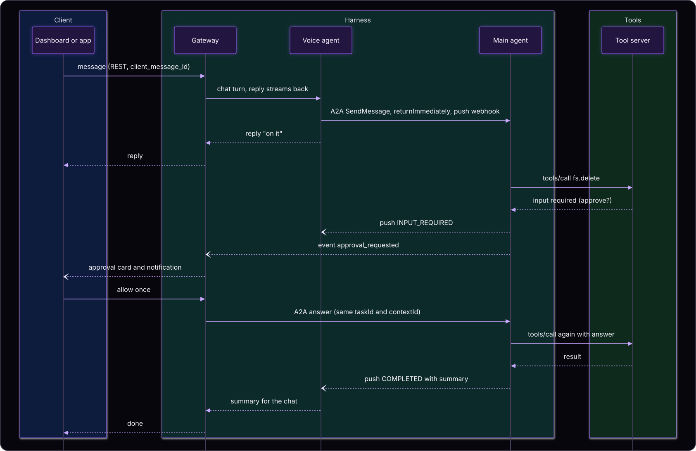
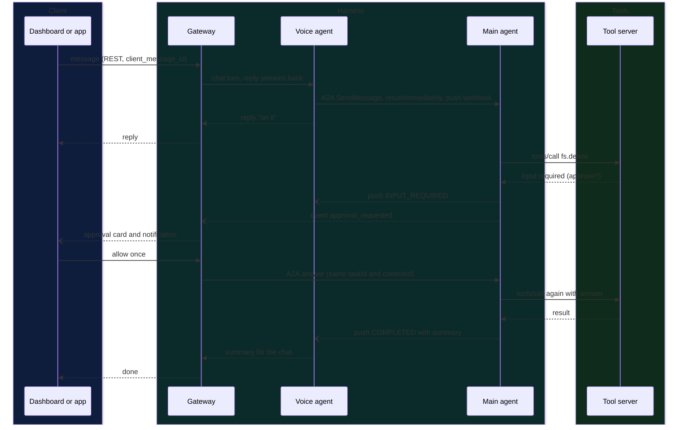
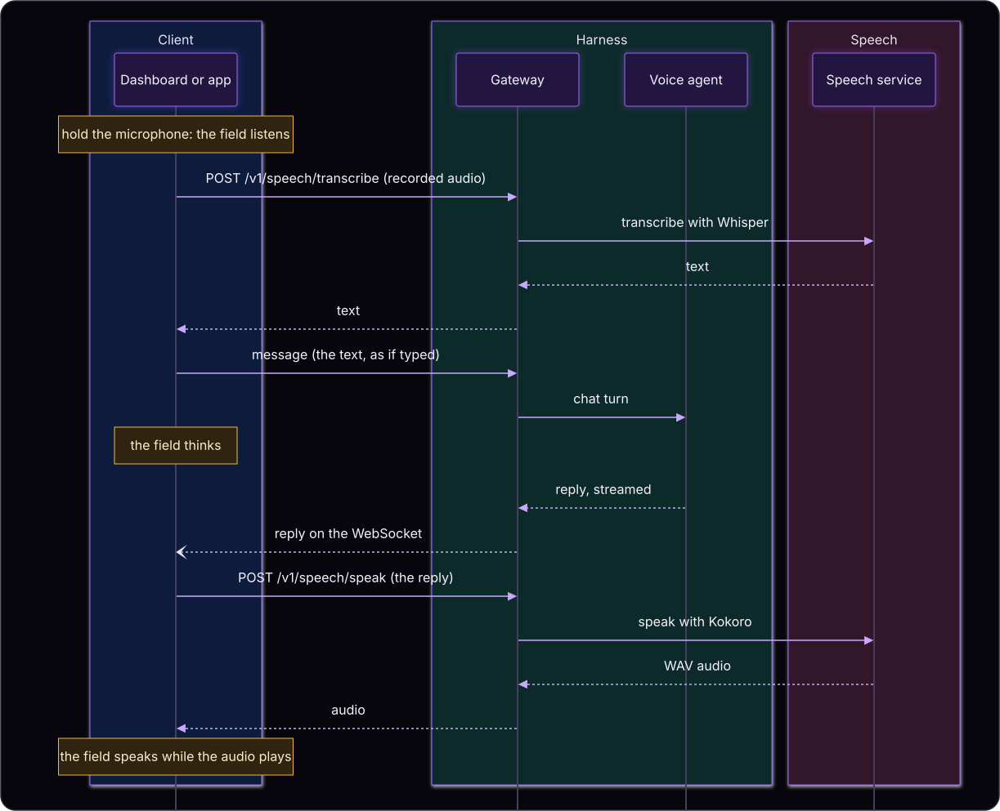
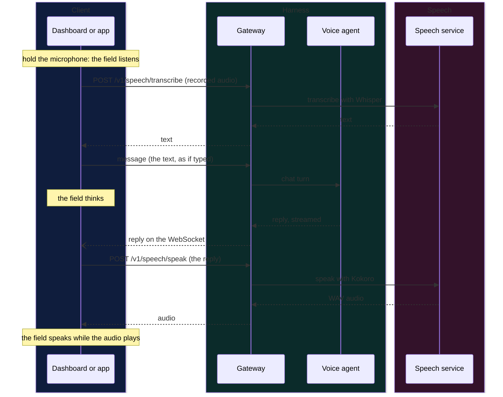
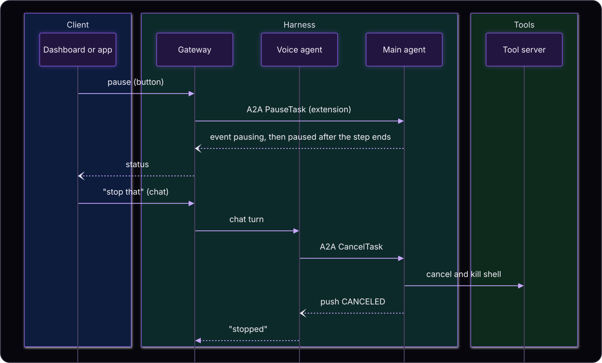
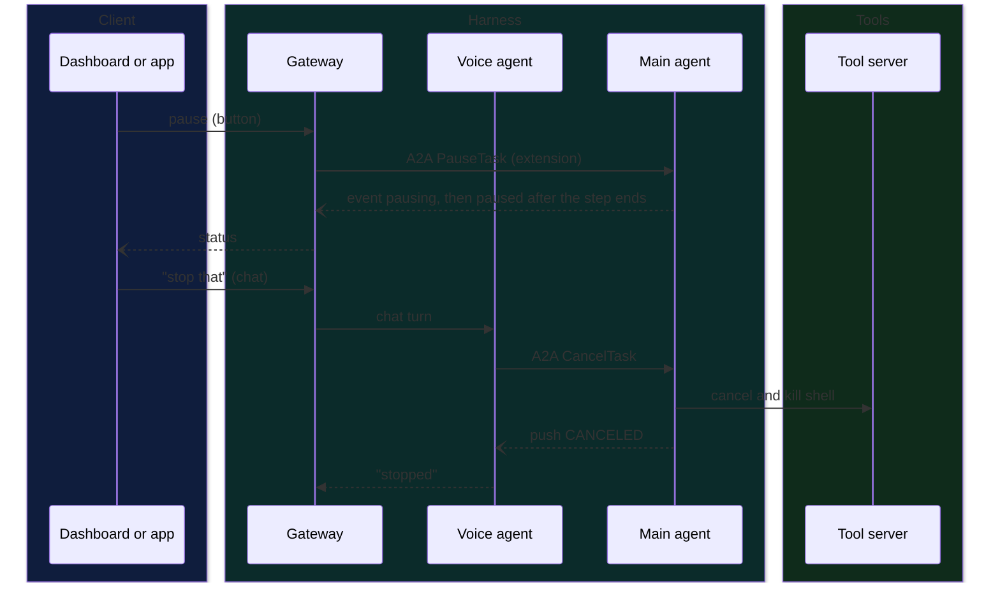
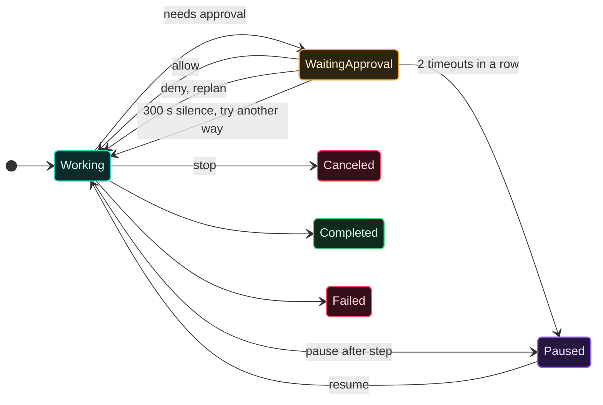

# Major Flows and User Experience

Status: Accepted design (2026-09-30), updated to the system as built (2026-10-01). Each picture is rendered from the Mermaid text folded under it.

## Navigation and screens

Mermaid source

- **Chat** shows messages and, for each delegated task, a task card: a status dot (green done, red failed or stopped, orange running or waiting), the instruction, and a small arrow that opens its steps (LLM calls, tool calls, approvals, the result). Approvals appear as cards in the chat with allow once, allow always, and deny. Agent text is rendered as markdown. The stats strip under the thread shows the model, tokens per second, and context use for each agent; values the endpoint does not report show as unknown. The voice field sits behind the messages (see below).
- **Trace** holds the full detail for a task, kept 30 days. The task list can be grouped by chat or by project and sorted.
- **Tools** shows the tool server of each project and a chat's allow-always rules, which can be revoked.
- **Monitor** shows CPU, RAM, VRAM per GPU, network, tokens per second, latency per service, queue loads, and service state, live every second, with history ranges from 15 minutes to 7 days.
- **Settings**: provider and model per agent, load parameters for LM Studio, context compaction threshold, system prompts (read, edit, save, version history), API key status (set or not set, with the env variable name and a reload button; the UI never writes keys), paired devices with pairing and revoke (dashboard), backup, keep-awake and retention, theme, and the face animation switch. On the phone also: stay connected, app lock, unpair.
- **Projects and files (phone and dashboard)**: a project is a folder on the PC. The phone can make a project by browsing the PC's folders, and can browse, search, and read text files inside a project.

## First run and pairing

1. `uv run thursday up` starts the services. The dashboard on the PC is trusted through the localhost listener.
2. In Settings choose a provider and model for each agent. For LM Studio, adopt the loaded model or load it with the configured parameters.
3. Publish the gateway's proxy port inside the tailnet once: `tailscale serve --bg http://127.0.0.1:8701`.
4. In Settings, Devices the dashboard makes a single-use pairing code, valid five minutes, and shows it as text and as a QR code holding the PC's tailnet address and the code.
5. The phone scans the QR code (or the address and code are typed) and sends the code plus a device name to the gateway. The gateway burns the code and returns a long-lived device token, which the phone stores in the Android Keystore.
6. Paired devices are listed in Settings and can be revoked; a revoked phone is disconnected at once and shows that it was removed.

## Main flow: instruction with an approval

Mermaid source

Approval answers come from the gateway (a button in a client) or from the voice agent (a spoken or typed yes or no, recognised in code while an approval is pending). The first answer wins; a later one receives an "already resolved" error.

## Voice: push-to-talk and read aloud

Mermaid source

Speech is a thin layer around the normal chat: the transcribed text is sent as an ordinary message, so delegation, spoken approvals, and the timeline work exactly as with typing. Replies are read aloud only when the speaker button is on. No audio is stored anywhere. Continuous listening is not built.

### The voice field

- **The line** along the bottom of the chat is always there: particles carried across the screen by a mild breeze. While you talk or the agent speaks it pulses with the sound, low tones on the left and high on the right, taller when louder.
- **The face** gathers out of the breeze while the agent listens (greens and blues, leaning toward you), thinks (blue, violet, and magenta, looking slowly from side to side), or speaks (cyan through pink to orange, lips and jaw moving with the words). When the agent goes idle the face is blown away.
- The face can be switched off in Settings; the line stays. People who turn off animations in their system get still frames.

## Task control

Mermaid source

A stop button goes directly from the gateway to the main agent. To amend a running task the user stops it and sends a new instruction in the same context.

## Approval states

Mermaid source

## Failure and recovery

| Failure | Behavior |
|---|---|
| No approval in 300 seconds | Request cancelled (not declined); model told "user did not respond"; two in a row auto-pause the task and notify |
| Two approval answers | First wins; second gets "already resolved" |
| Voice agent down or busy | Main agent retries the push a few times; on restart the voice agent lists its open tasks and catches up; approval notifications still come from the gateway |
| Gateway down | Agents keep working; events wait in outboxes; clients cannot connect |
| Tool server crash | Error result goes to the model so it can replan; the server restarts on the next call |
| Stop during a tool call | MCP cancellation, running shell process killed, task ends canceled |
| LLM endpoint down | Banner; chat messages queue; a running task retries the call three times with increasing delays then fails with a notification; paused or waiting tasks are unaffected |
| Main agent restart mid-task | Resumes from the last checkpoint; a call that started without a result is reported to the model as unknown and verified, never blindly re-run |
| Model still loading | "Loading model" status and timeline event; request timeouts and retries do not fire during a load |
| Phone off the tailnet | App shows "PC unreachable"; reconnect with a cursor replays missed events |
| Phone revoked or re-paired | A revoked phone shows that it was removed; pairing again restores the connection and the notification |
| Speech service down or a model cannot load | The microphone and speaker buttons report it; typing still works |
| A service crashes | The launcher restarts it after a delay; Monitor shows the restart count |
| Stale or lost read model | Rebuilt from agent replay endpoints within the 30 day window |

## Data handling and feedback

- Chats and history can be created, searched, renamed, and deleted. Deletes are confirmed in the app's own dialog and remove every record from every service.
- Every list has loading, empty, and error states. Sends show queued, delivered, and failed states. Banners show dependency problems (for example the LLM endpoint down, cloud provider in use).
- Hidden screens do not poll; a client resumes by replaying events from its last cursor. Lists refresh when a project or chat is made, renamed, or deleted on another device.
