# Important Security Boundaries

Status: Accepted design (2026-09-30), updated to the system as built (2026-10-01). The rules below are implemented, and the ones a test can check have automated tests (listener guard, device tokens and pairing limits, workspace sandbox, approvals, file views). There has been no independent security review.

## Assets and actors

- **Assets:** the files and shell of the PC (reachable by the tool server), chat and trace content (may contain file contents and command output), API keys, device tokens, the microphone on the PC and the phone, the Android app's signing key.
- **Actors:** the owner (single user); paired devices (equal power, revocable); the LLM agents (untrusted decision makers); external content the model reads (untrusted).

## Trust boundaries

```mermaid
%% svg: trust-boundaries
flowchart TB
  subgraph TN["Your tailnet"]
    phone(["Phone app<br/>device token in the Android Keystore"])
  end
  subgraph PC["Your PC"]
    direction TB
    ts("Tailscale Serve<br/>HTTPS front")
    dash(["Dashboard<br/>browser on localhost"])
    gw("Gateway<br/>two listeners")
    agents("Agents<br/>voice and main")
    speech("Speech service<br/>stores no audio")
    lm[("LM Studio<br/>local LLM")]
    tools("Tool server<br/>sandbox and policy")
  end
  subgraph NET["Internet"]
    cloud[("Cloud LLM<br/>optional")]
  end
  phone -->|"1 HTTPS and device token"| ts
  ts -->|"2 proxy port, token always"| gw
  dash -->|"3 localhost port, trusted"| gw
  gw -->|"4 service token"| agents
  gw -->|"4 service token"| speech
  agents -->|"5 local"| lm
  agents -->|"6 stdio, policy enforced here"| tools
  agents -.->|"7 data leaves the PC"| cloud
  classDef client fill:#0f1d3d,stroke:#4d8dff,color:#dbe7ff,stroke-width:1.5px
  classDef edge fill:#1b1826,stroke:#8d81a6,color:#e9e4f5,stroke-width:1.5px
  classDef gateway fill:#0b2b2a,stroke:#2dd4bf,color:#d3fbf4,stroke-width:1.5px
  classDef agent fill:#24163f,stroke:#9b63ff,color:#eadcff,stroke-width:1.5px
  classDef tool fill:#0f2b1b,stroke:#4ade80,color:#d7fbe4,stroke-width:1.5px
  classDef speech fill:#33122a,stroke:#ff5c8a,color:#ffd9e6,stroke-width:1.5px
  classDef external fill:#1a1630,stroke:#c9a8ff,color:#f1e8ff,stroke-width:1.5px
  classDef danger fill:#35101a,stroke:#ff4d5e,color:#ffd6da,stroke-width:1.5px,stroke-dasharray:5 4
  class phone,dash client
  class ts edge
  class gw gateway
  class agents agent
  class tools tool
  class speech speech
  class lm external
  class cloud danger
  style TN fill:#0b1226,stroke:#4d8dff,stroke-dasharray:6 4
  style PC fill:#0d0b16,stroke:#463d5c,stroke-dasharray:6 4
  style NET fill:#1c0a10,stroke:#ff4d5e,stroke-dasharray:6 4
```

Mermaid source

| # | Crossing | Rule |
|---|---|---|
| 1 | Tailnet device to TLS front | HTTPS; a device token on every call except pairing claim |
| 2 | TLS front to gateway | Goes only to the proxy listener, which always requires a device token |
| 3 | PC dashboard to gateway | The localhost listener, trusted; only software on the PC can reach it. It is separate from the proxy listener so proxied tailnet requests never look like localhost |
| 4 | Gateway to agents and the speech service | Localhost only, service token generated at setup and kept in `.env` |
| 5 | Agents to LM Studio | Local |
| 6 | Main agent to tool server | stdio child process; the tool server enforces sandbox and policy |
| 7 | Agents to a cloud LLM | Everything in the model context leaves the PC; the UI marks this in Settings and in the chat header |

## Guarantees

- **The model cannot approve its own actions.** Approval answers come only from a human action in a client or from stored allow rules, never from model output.
- **Sandbox and policy live in the tool server.** It resolves every path and refuses anything outside the project folder, including `..`, symlinks, junctions, short names, and UNC paths. Shell commands and deletes ask for approval regardless of any prompt.
- **Allow always** is scoped to one chat, shown in Tools, revocable, and accompanied by a clear warning when chosen for shell.
- **Pairing codes** are created only through the localhost listener, are single use, and expire quickly. Device tokens are long and random, stored hashed on the PC and in the Android Keystore on the phone, and can be revoked. Pairing attempts are rate limited.
- **The dashboard is local only.** It is served on the localhost listener, which checks the Host and Origin of every request and needs a custom header on writes, so another website or a DNS-rebinding page cannot drive it. The proxy listener serves no pages, only the API with a device token.
- **Folder and file views:** a paired device can list folder names anywhere on the PC (to choose a project folder) and can read text files inside project folders (first 200 kB, read-only). This matches what a paired device could already do by asking the agent; nothing outside a project folder can be read, and nothing can be written this way.
- **Phone safeguards:** the app asks for the phone's lock-screen credential or fingerprint before risky approvals and before changing Settings; an optional app lock (fingerprint or phone PIN) locks the whole app.
- **Speech:** audio recorded for push-to-talk goes to the gateway and the local speech service, is turned into text, and is dropped; replies are spoken from text. No audio is stored or sent off the PC. The apps ask for the microphone only when the button is first used; the phone's camera is used only to scan a pairing code.
- **App signing:** release builds of the Android app are signed with a key that stays outside the repository (`apps/android/keystore.properties` and the key file are git-ignored). Whoever holds that key can publish an update that phones will accept, so it is kept and backed up like a password.
- **Secrets:** API keys and the service token live in `.env` (git-ignored; `.env.example` holds placeholders). The UI never writes keys and shows only whether they are set. Keys never appear in databases, traces, or logs; traces store request and response bodies but never headers.
- **Untrusted output:** model and tool output is rendered as sanitized text or markdown, never as HTML; tool output and stored bodies are size-capped.
- **Auditability:** the tool server logs every call and permission decision in its own SQLite; the gateway shows approvals and tool calls in the timeline and trace. Traces and logs are kept 30 days.
- **Backups** contain transcripts, projects, and device token hashes, so the backup folder must be treated as sensitive. `.env` is never included.

## Abuse and failure cases to verify

Prompt injection through file content or web pages must not widen permissions; a proxied tailnet request must not reach the localhost listener; sandbox escape attempts on Windows paths; a lost phone token is revocable and cannot approve risky actions without the phone credential; replayed or duplicate approval answers are harmless; the tool server keeps enforcing policy after a main-agent restart.

## Open security decisions

- Retention and redaction policy for trace bodies beyond the 30 day limit (for example optional pattern redaction).
- Whether the tool server needs a hard deny list independent of approvals.
- Public certificate logs will list the Tailscale machine name; rename it first if it is sensitive.
- The face in the voice field was derived from a stock picture; its licence must be checked before the repository is published (or the face regenerated from a picture that may be redistributed).
